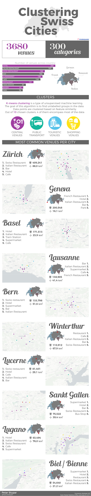
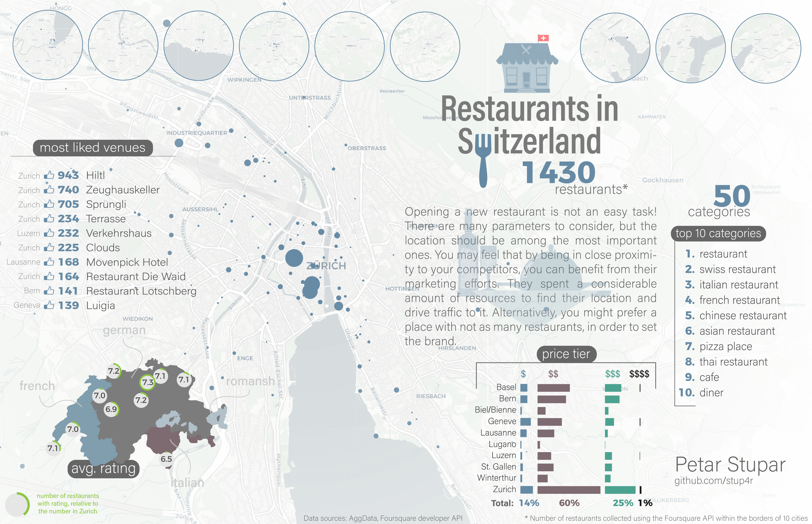

# Clustering Swiss Cities

Detailed report, static and interactive infographics can be found on [THIS WEBPAGE](https://stup4r.github.io/clustering_swiss_cities/index.html)

Moving to another city or even a different area within a city, is a difficult decision to make. Likewise, searching for a perfect city to start a new business, or simply moving to another location (city) is not an easy task. 
Whether you open a new restaurant, a hotel or a bar, you need to know the existing market in the potential city of your choice. It would be beneficial to know what people are like, what kind of activities they prefer, and places they go to. There are many parameters to consider, but the location should be among the most important ones. You may feel that by being in close proximity to your competitors, you can benefit from their marketing efforts. They spent a considerable amount of resources to find their location and drive traffic to it. Alternatively, you would prefer a place with not as many similar businesses, in order to set the brand. One or the other, location data is an important asset in such decision-making processes. Putting efforts into making a good use of it could be beneficial for anyone considering starting a new business or moving it to another location.

For more information, have a look at the .

